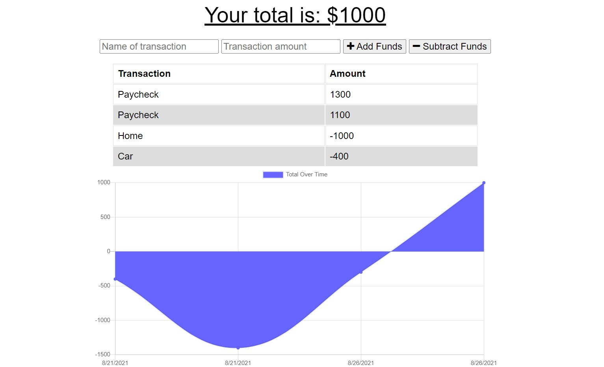
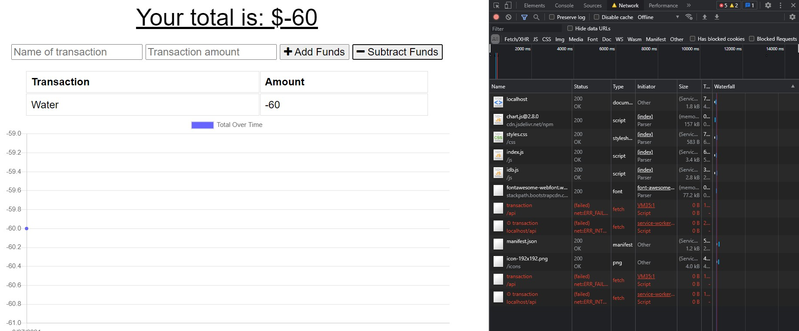

# Budget Tracker PWA

## License

## Description
A budget tracker application that allows for offline access and functionality. The user is able to add expenses and deposits to their budget with or without an internet connection.

Deployed application on heroku: https://budget-tracker-pwa6249261.herokuapp.com/

### Screenshots
#### Online

#### Offline

## Table of Contents
 * [Installation](#installation)
 * [Usage](#usage)
 * [Contributing](#contributing)
 * [Questions](#questions)
        
## Installation
Clone this repository and enter `npm install` in the terminal to install the necessary dependencies.
   
## Usage
Enter `node server.js` or `npm start` to connect to the localhost.
Open `http://localhost:3001/` to use the application.

## Contributing
Charity Rogers

## Questions
If you have any questions, please contact me!

  - GitHub: https://github.com/rogerscl116
  - Email: rogerscl116@gmail.com 
